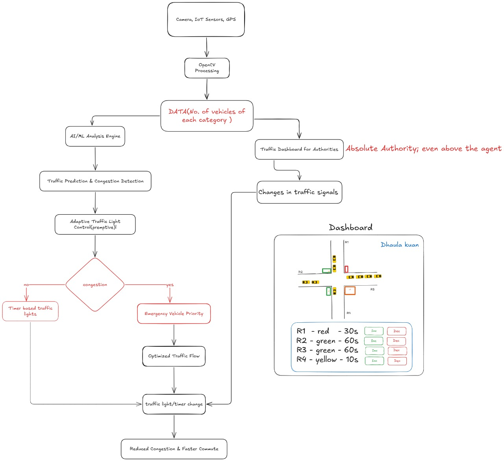

# live Demo - https://sihprototype-arsd.vercel.app/
# Smart Traffic Management System for Urban Congestion

## 🚦 Overview
This project is an **AI-powered Smart Traffic Management System** designed to reduce urban congestion by dynamically optimizing traffic signal timings. It simulates real-time traffic data, prioritizes emergency vehicles, and provides actionable insights via a dashboard.

---

## 💡 Features
- **Real-time Traffic Monitoring**: Uses simulated CCTV and IoT sensor data to detect vehicle counts and lane congestion.  
- **Adaptive Signal Control**: Reinforcement Learning or rule-based logic adjusts signal durations dynamically.  
- **Emergency Vehicle Priority**: Detects ambulances, fire trucks, and police vehicles to clear their route instantly.  
- **Dashboard**: Central interface for traffic authorities showing live traffic, signal timings, and alerts.  
- **API Integration**: Provides real-time traffic data for third-party apps (like Google Maps) for better route suggestions.  

---

## 🎯 Impact & Benefits
- **Commuters**: Reduced waiting times, smoother travel, optimized GPS routing.  
- **Authorities**: Real-time monitoring and manual override capabilities.  
- **Emergency Services**: Faster response times for ambulances and fire brigades.  
- **City Planners / Apps**: API enables improved route planning and traffic flow analysis.  
- **Environmental & Economic**: Less fuel wastage, lower emissions, shorter commute times.  

---

## ⚙️ Feasibility & Demo Approach
- Fully **software-based simulation** using random/hardcoded traffic data.  
- **Dashboard + signal logic** implemented in React + JS/Python.  
- RL timing  
- Single intersection demo with manual triggers for emergency vehicles.  
- **API endpoint** serves simulated traffic data to external apps.  

---

**Architecture Diagram:**


---


## 📌 How to Run the Demo
1. Clone the repository:  
   ```bash
    git clone https://github.com/Abhishekkr206/SIH.git
    cd frontend
    npm install
    npm run dev